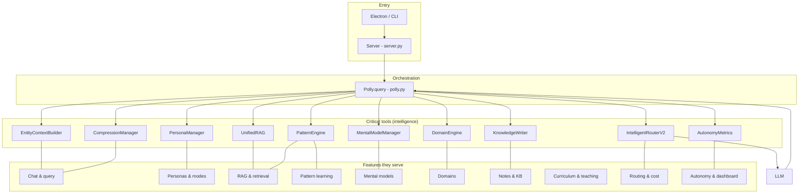
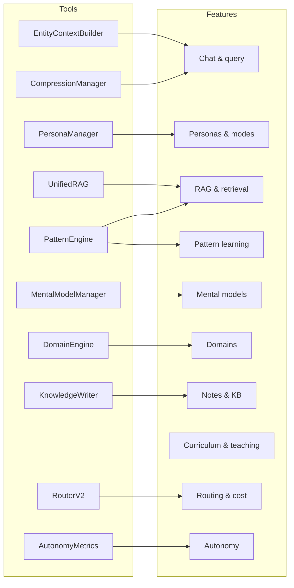

# Polly Architecture Map

**Narrative and map of the architecture: critical tools, data flow, and the features they serve.**

This document complements [openspec/specs/architecture/spec.md](../openspec/specs/architecture/spec.md) and the [architecture overview diagram](../architecture-overview.svg) by telling the story of how tools and features connect.

---

## 1. The Big Picture

Polly is an **edge-native personal AI system** for polymathic practice. A user message flows through:

1. **Entry** — Electron app or CLI sends a query to the REST server.
2. **Orchestration** — `Polly.query()` in `core/polly.py` coordinates everything.
3. **Intelligence** — Domain detection, RAG retrieval, context gathering, routing, then the LLM.
4. **Learning** — Outcomes feed patterns, optional knowledge writes, and autonomy metrics.

The **critical tools** are the components that own behavior and state; **features** are the user-visible capabilities those tools enable. The map below ties each tool to the features it supports.

---

## 2. Critical Tools and What They Do

| Tool | Location | Role |
|------|----------|------|
| **DomainEngine** | `core/domains.py` | Detects which domains (e.g. code, writing, learning) a query touches. Drives domain-aware RAG, patterns, mental models, and prompts. |
| **UnifiedRAG** | `core/rag.py` | Hybrid search (ChromaDB + BM25), optional LLMLingua compression. Returns the “retrieved knowledge” slice that gets injected into the prompt. |
| **PatternEngine** | `core/patterns/` | Learns and serves patterns (query→chunk, domain→collection, ROUTING_OUTCOME). Used for RAG boosting, collection weighting, and (planned) routing hints. |
| **MentalModelManager** | `core/mental_models.py` | Stores and activates mental models. Builds the “Active Mental Models” context block (ContextContributor, priority 60). |
| **EntityContextBuilder** | `core/entities/context.py` | Builds entity-focused context from the entity graph (ContextContributor, priority 40). |
| **CompressionManager** | `core/compression/` | Conversation summary (LLM) and RAG context compression (LLMLingua). Builds the conversation-summary context block (ContextContributor, priority 10). |
| **IntelligentRouterV2** | `core/router_v2.py` | Picks tier (Fast/Balanced/Thorough), provider, and model. LiteLLM or legacy adapters. Budget-aware, hybrid local/cloud. |
| **PersonaManager** | `core/personas/manager.py` | Resolves active persona and mode, builds system prompt, notifies PersonaAware systems (PatternEngine, EntityContextBuilder, MentalModelManager). |
| **KnowledgeWriter** | `core/knowledge_writer.py` | Scribe/quick/message save from chat to KB; gap detection; triggers incremental RAG index. |
| **AutonomyMetrics** | `core/autonomy_metrics.py` | Records knowledge writes and routing decisions in `usage.db`; feeds dashboard and autonomy views. |
| **EntityStore** | `core/entities/store.py` | SQLite-backed entity graph (`~/.polly/entities.db`). Used by EntityContextBuilder and (planned) knowledge graph retrieval. |
| **Capability Broker** | `core/capability_broker.py` | Phase 23.5: sandboxed tool execution, allowlist, user approval for sensitive actions. |
| **Server** | `interfaces/server.py` | REST API: `/polly/query`, personas, mental models, notes, domains, curricula, integrations, settings, etc. |

---

## 3. Features and the Tools That Serve Them

### Chat & query

- **Feature:** User sends a message and gets a streamed AI response.
- **Tools:** Polly (orchestration), DomainEngine (domains), UnifiedRAG (retrieval), PatternEngine + MentalModelManager + EntityContextBuilder + CompressionManager (context), PersonaManager (prompt), IntelligentRouterV2 (model choice), then LLM. Post-response: PatternEngine (ROUTING_OUTCOME), optional KnowledgeWriter, AutonomyMetrics.

### Personas & modes

- **Feature:** Architect/Scribe/Professor (and planned Programmer, Librarian, Designer, Administrator) with mode switching.
- **Tools:** PersonaManager (state, system prompt, mode), PersonaAware protocol (PatternEngine, EntityContextBuilder, MentalModelManager get `set_active_persona`).

### RAG & retrieval

- **Feature:** Answers grounded in notes, code, and other indexed content; hybrid search; optional compression.
- **Tools:** UnifiedRAG (hybrid search, optional LLMLingua), DomainEngine (domain filtering), PatternEngine (query→chunk and domain→collection boosting).

### Pattern learning

- **Feature:** System improves from usage (better retrieval, future routing hints).
- **Tools:** PatternEngine (learn/search/storage), Polly (`_record_routing_outcome`, _gather_context), RAG (uses patterns for boosting).

### Mental models

- **Feature:** User configures and activates mental models; they’re injected into the prompt.
- **Tools:** MentalModelManager (storage, activation, build_context), PersonaAware (persona-aware activation).

### Domains

- **Feature:** User-defined domains (e.g. Sigils, Scrolls); domain detection and domain-aware behavior everywhere.
- **Tools:** DomainEngine, domain_config / `domains.json`; used by RAG, patterns, mental models, notes, routing (planned).

### Notes & knowledge base

- **Feature:** Native notes, sync, templates, “save from chat” to KB, incremental indexing.
- **Tools:** Notes API (server), KnowledgeWriter (save from chat, gap detection), UnifiedRAG (`index_single_document`), filesystem/obsidian endpoints.

### Curriculum & teaching

- **Feature:** Curricula, sections, exercises, teaching mode, review.
- **Tools:** Learners/curriculum, server curricula/exercises/teaching endpoints, Professor persona.

### Routing & cost

- **Feature:** Three-tier routing, budget, hybrid local/cloud, multiple providers.
- **Tools:** IntelligentRouterV2, providers (LiteLLM/legacy), BudgetManager, AutonomyMetrics (routing decisions).

### Autonomy & dashboard

- **Feature:** Visibility into knowledge writes and routing; autonomy snapshot.
- **Tools:** AutonomyMetrics, KnowledgeWriter, server settings/autonomy APIs.

### Security & capabilities

- **Feature:** Sandboxed execution, allowlist, user approval for sensitive operations.
- **Tools:** Capability Broker, server capabilities/packages endpoints.

### Integrations

- **Feature:** Obsidian, GitHub, filesystem, calendar, etc.
- **Tools:** `integrations/`, server integration and filesystem endpoints.

---

## 4. Query Hot Path (Where the Tools Meet)

When a user sends a message, the following happens in order:

1. **Resolve persona** — PersonaManager (or passed-in persona/mode).
2. **Detect domains** — DomainEngine → list of domain IDs.
3. **Notify persona-aware systems** — PatternEngine, EntityContextBuilder, MentalModelManager receive `set_active_persona`.
4. **RAG retrieval** — UnifiedRAG (hybrid search, optional LLMLingua) → `rag_context`.
5. **Gather context** — `_gather_context` calls ContextContributors by priority:
   - 60: MentalModelManager  
   - 40: EntityContextBuilder  
   - 20: PatternEngine  
   - 10: CompressionManager (conversation summary)
6. **Build augmented prompt** — Domain prompt + RAG context + gathered context + persona/mode instructions.
7. **Route** — IntelligentRouterV2 → provider/model (LiteLLM or legacy).
8. **LLM** — Streaming completion.
9. **Post-response** — `_record_routing_outcome` → PatternEngine; optional KnowledgeWriter save; AutonomyMetrics.

So in one query, the **critical tools** that participate are: DomainEngine, PersonaManager, UnifiedRAG, MentalModelManager, EntityContextBuilder, PatternEngine, CompressionManager, IntelligentRouterV2, PatternEngine (again for outcomes), and optionally KnowledgeWriter and AutonomyMetrics.

---

## 5. Integration Contracts (How Tools Stay in Sync)

Cross-system behavior is formalized in `core/protocols/`:

| Protocol | Implementors | Used for |
|----------|--------------|----------|
| **ContextContributor** | MentalModelManager (60), EntityContextBuilder (40), PatternEngine (20), CompressionManager (10) | `_gather_context`: ordered context blocks for the prompt. |
| **PersonaAware** | PatternEngine, EntityContextBuilder, MentalModelManager | After domain detection, Polly calls `set_active_persona` so context and learning are persona-scoped. |
| **PatternConsumer** | Router (via Polly) | Polly records ROUTING_OUTCOME patterns; (planned) router uses patterns for model selection. |
| **EntityProvider** | EntityStore / knowledge graph | Shared entity model; (planned) entity-graph retrieval. |

These contracts are what make “persona + domain + patterns + entities + mental models” compose in one query instead of acting as islands.

---

## 6. Data Stores (Where State Lives)

| Store | Purpose | Key tools that use it |
|-------|---------|------------------------|
| SQLite (Electron) | Chat history, compression state | Electron app, compression |
| `~/.polly/entities.db` | Entity graph | EntityStore, EntityContextBuilder |
| `~/.polly/usage.db` | Autonomy metrics, budget | AutonomyMetrics, BudgetManager |
| `~/.polly/chroma/` | RAG embeddings | UnifiedRAG |
| `~/.polly/` (files) | Domains, patterns, mental models, curricula, templates | DomainEngine, PatternEngine, MentalModelManager, learners |
| Mem0 (optional) | Adaptive memory | PatternEngine (optional backend) |

---

## 7. Graphical Map (Tools and Features)

The diagram below summarizes **critical tools** and the **features** they relate to. Same information as the tables above, in visual form.

**Simplified “tools → features” block view:**

---

## 8. Planned Tools and Features (Vision)

From the architecture and roadmap specs, future tools and their feature impact:

| Planned tool / subsystem | Feature(s) |
|--------------------------|------------|
| **Nexus (Agent Swarms)** | Multi-agent workflows, task decomposition, agent selection. |
| **DRM Router** | Distributed node selection (which node handles the query). |
| **Knowledge Quality Pipeline** | Anti-slop, authority scoring, dedup, maintenance. |
| **Capture System** | Multi-modal capture, PARA, maturity lifecycle. |
| **BAD Canvas** | Structured project planning. |
| **Publishing Pipeline** | POSE, Ghost CMS, multi-platform. |
| **Code Library / BookLore** | Reusable code modules, book management, library RAG. |
| **Design Engine** | Designer persona, p5.js, design systems. |
| **Constitutional layer** | Epistemology foundation (how Polly thinks). |

These are not in the current “critical tools” set but are part of the target architecture.

---

## 9. Reference

- **Architecture spec:** [openspec/specs/architecture/spec.md](../openspec/specs/architecture/spec.md)  
- **Overview diagram:** [architecture-overview.svg](../architecture-overview.svg)  
- **Roadmap:** [openspec/specs/project/roadmap.md](../openspec/specs/project/roadmap.md)  
- **RAG & routing:** [docs/RAG_ROUTING_ARCHITECTURE.md](RAG_ROUTING_ARCHITECTURE.md)  
- **Personas:** [docs/PERSONA_SYSTEM_ARCHITECTURE.md](PERSONA_SYSTEM_ARCHITECTURE.md)
