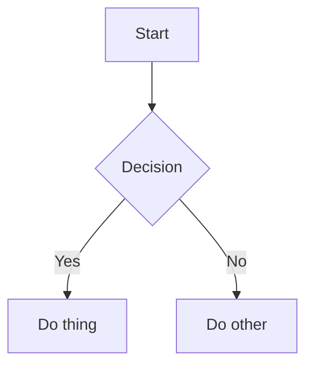

# Phase 16: Obsidian Migration Analysis & Feature Compatibility

**Date:** January 26, 2026  
**Status:** Complete - Ready for Implementation  
**Impact:** Phase 16a/16b timeline increases from 3-4 weeks to **5 weeks**

---

## Executive Summary

This document captures a comprehensive analysis of Obsidian-to-Polly migration requirements, identifying critical architectural gaps and feature preservation needs that weren't addressed in the original Phase 16 specification.

### Key Findings

1. **Critical Gap: Note Source Management Missing**
   - Original spec doesn't address how Obsidian integration and native notes coexist
   - Risk of duplicate content in RAG collection
   - No clear migration path from Obsidian to native

2. **Feature Preservation Requirements**
   - 15 Obsidian features identified requiring special handling
   - Dataview queries need conversion strategy (7 features detected in test vault)
   - Math notation and Mermaid diagrams identified as v2 features

3. **Timeline Impact**
   - Phase 16a: +3 days (Note Source Management + File Watcher + Validation + Domain Tracking + Attachments)
   - Phase 16b: +3.5 days (Embeds + Heading Links + Aliases + Callouts)
   - Total: **5-5.5 weeks** (was 3-4 weeks)

---

## Obsidian Feature Compatibility Matrix

### Category A: Fully Preserved (No Special Handling)

These work automatically with Monaco + marked.js:

| Feature | Syntax | Status |
|---------|--------|--------|
| Standard Markdown | `# Header`, `**bold**`, `- list` | ✅ Works out of box |
| Code Blocks | ` ```python\ncode\n``` ` | ✅ highlight.js support |
| Task Lists | `- [ ] Task` | ✅ Standard markdown |
| Images | `` | ✅ Standard markdown |
| Tables | `\| Col \| Col \|` | ✅ GFM support |
| Standard Links | `[text](url)` | ✅ Standard markdown |

### Category B: Preserved with Special Handling

These need specific implementation:

| Feature | Syntax | Phase | Implementation Needed |
|---------|--------|-------|----------------------|
| **Wiki-links** | `[[Note]]` or `[[Note\|Display]]` | 16b | ✅ Already in spec (lines 815-925) |
| **Backlinks** | Automatic reverse index | 16b | ✅ Already in spec (lines 927-1008) |
| **Tags (inline)** | `#tag`, `#nested/tag` | 16b | ✅ Already in spec (lines 1011-1096) |
| **Tags (frontmatter)** | `tags: [tag1, tag2]` | 16b | ✅ Already in spec |
| **Frontmatter (YAML)** | `---\nkey: value\n---` | 16b | ✅ Already in spec (lines 1180-1225) |
| **Note Embeds** | `![[Note Name]]` | 16b | ❌ **MISSING - Must add** |
| **Heading Links** | `[[Note#Section]]` | 16b | ❌ **MISSING - Must add** |
| **Aliases** | `aliases: [name1, name2]` in frontmatter | 16b | ❌ **MISSING - Must add** |
| **Callouts** | `> [!note] Title` | 16b | ❌ **MISSING - Must add** |
| **Footnotes** | `[^1]` with `[^1]: text` | 16b | ⚠️ marked.js supports, needs testing |

### Category C: Not Preserved (v1 Limitations)

These won't work in Polly v1:

| Feature | Syntax | Migration Impact |
|---------|--------|------------------|
| **Canvas Files** | `.canvas` (JSON) | Skip during import, warn user |
| **Dataview Queries** | ` ```dataview\nLIST\n``` ` | Offer conversion (static/link/remove) |
| **Math (LaTeX)** | `$$formula$$` or `$inline$` | Render as plain text, document limitation |
| **Mermaid Diagrams** | ` ```mermaid\ngraph\n``` ` | Render as code block, document limitation |
| **Obsidian Plugins** | Any plugin functionality | Not applicable, must re-implement |
| **Custom Themes** | `.obsidian/themes/` | Not applicable, Polly has own themes |

---

## Critical Architectural Gap: Note Source Management

### The Problem

The current Phase 16 spec says "one-time Obsidian import" but doesn't address:

1. **Conflicting integrations:** How do the existing Obsidian integration (`integrations/obsidian.py`) and new native notes coexist?
2. **RAG collection naming:** Current RAG has `'obsidian'` collection, native notes need `'notes'` collection
3. **User personas not addressed:**
   - **Obsidian-Only:** Want to keep using Obsidian, just index for RAG
   - **Native-Only:** New users, all-in-one Polly experience
   - **Migrating:** Have Obsidian, want to fully migrate and stop using it

### The Solution: Note Source Management System

**Decision:** Single source for v1 (either Obsidian OR native, not both)

#### Config Changes

```yaml
# ~/.polly/config.yaml
notes:
  source: "native"  # Options: "obsidian" or "native"
  obsidian:
    vault_path: "~/Documents/Obsidian/MyVault"
    enabled: false
  native:
    path: "~/.polly/notes"
    enabled: true
```

#### RAG Collection Strategy

**Change:** Rename `'obsidian'` collection to `'notes'` (generic name)

```python
# core/rag.py (line 343-360)
# BEFORE:
self.collections = {
    'obsidian': self.client.get_or_create_collection(
        name="obsidian_vault",
        ...
    ),
    ...
}

# AFTER:
self.collections = {
    'notes': self.client.get_or_create_collection(  # ← RENAMED
        name="notes",  # ← Generic name
        ...
    ),
    ...
}
```

**Why:** 
- Single collection avoids duplicate results in RAG queries
- Source switching is clean: clear collection, re-index from new path
- 95% of users will fully migrate (either direction)

#### New Component: NotesSourceManager

```python
# core/notes_source_manager.py (NEW FILE)
class NotesSourceManager:
    """Manages note source selection and migration."""
    
    def get_active_source(self) -> Literal["obsidian", "native"]:
        """Returns currently active source"""
    
    def get_notes_path(self) -> Path:
        """Returns path to active notes directory"""
    
    def switch_source(self, new_source: str, rag_system):
        """Switch between sources (clears RAG, re-indexes)"""
    
    def migrate_from_obsidian(self, vault_path: Path, ...):
        """Full migration: copy notes → switch source → re-index"""
```

#### New Server Endpoints

```python
# interfaces/server.py
@app.get("/polly/notes/source")
async def get_notes_source():
    """Get current notes source"""

@app.post("/polly/notes/source/switch")
async def switch_notes_source(request: SwitchSourceRequest):
    """Switch between obsidian and native sources"""
```

**Time Impact:** +2 days to Phase 16a (Days 4-5 of Week 1)

---

## Enhanced Migration Wizard

### New Step 3: Compatibility Check (Insert between Step 2 and original Step 3)

**Purpose:** Validate vault before import, detect incompatibilities, prevent broken imports

```
┌─────────────────────────────────────────────────────────┐
│           Compatibility Check: My Vault                 │
│                                                         │
│  Analyzing vault features...                            │
│  ✓ 147 markdown files scanned                           │
│  ✓ 342 wiki-links found (will be preserved)             │
│  ✓ 89 tags found (will be preserved)                    │
│                                                         │
│  ⚠️ 3 compatibility issues found:                       │
│                                                         │
│  ⚠️ 5 Canvas files (.canvas) - NOT SUPPORTED            │
│     Location: 02-Projects/diagrams/                     │
│     Action: These will be skipped during import         │
│                                                         │
│  ⚠️ 7 Dataview queries detected - REQUIRES CONVERSION   │
│     Files: project-dashboard.md, weekly-review.md       │
│     Action: You'll choose how to convert these next     │
│                                                         │
│  ℹ️ 12 notes use math notation ($$ or $)                │
│     Math will render as plain text in Polly v1          │
│     (LaTeX rendering planned for future release)        │
│                                                         │
│  ✅ Features that will work perfectly:                  │
│  • Wiki-links [[Note]] and [[Note|Alias]]               │
│  • Note embeds ![[Note]]                                │
│  • Heading links [[Note#Section]]                       │
│  • Tags #tag and #nested/tags                           │
│  • Frontmatter (YAML)                                   │
│  • Backlinks (will be rebuilt)                          │
│  • Callouts > [!note]                                   │
│  • Attachments (images, PDFs)                           │
│                                                         │
│              [Back] [Continue] [Cancel]                 │
└─────────────────────────────────────────────────────────┘
```

**Implementation:**

```python
# integrations/obsidian.py (ADD METHOD)
class ObsidianImporter:
    async def validateVault(self, vaultPath: Path) -> ValidationReport:
        """Scan vault for compatibility issues"""
        report = {
            'compatible': True,
            'warnings': [],
            'blockers': [],
            'statistics': {
                'totalFiles': 0,
                'wikiLinks': 0,
                'tags': 0,
                'canvasFiles': 0,
                'dataviewQueries': 0,
                'mathNotation': 0,
                'mermaidDiagrams': 0
            }
        }
        
        # Scan for Canvas files
        canvas_files = list(vaultPath.rglob("*.canvas"))
        report['statistics']['canvasFiles'] = len(canvas_files)
        if canvas_files:
            report['warnings'].append({
                'severity': 'info',
                'title': f"{len(canvas_files)} Canvas files detected",
                'message': 'Canvas files will be skipped during import'
            })
        
        # Scan markdown files
        md_files = list(vaultPath.rglob("*.md"))
        dataview_files = []
        
        for md_file in md_files:
            content = md_file.read_text(encoding='utf-8')
            
            # Check for Dataview queries
            if '```dataview' in content:
                dataview_files.append(md_file)
                queries = re.findall(r'```dataview\n([\s\S]*?)\n```', content)
                report['statistics']['dataviewQueries'] += len(queries)
            
            # Check for math notation
            if '$$' in content or re.search(r'\$[^$]+\$', content):
                report['statistics']['mathNotation'] += 1
            
            # Check for Mermaid diagrams
            if '```mermaid' in content:
                report['statistics']['mermaidDiagrams'] += 1
        
        if dataview_files:
            report['warnings'].append({
                'severity': 'warning',
                'title': f"{len(dataview_files)} Dataview queries detected",
                'message': 'Dataview queries must be converted (next step)',
                'requiresAction': True
            })
        
        return report
```

**Time Impact:** +1 day to Phase 16a (Day 3 of Week 2)

### New Step 4: Dataview Query Conversion (Insert after Compatibility Check)

**Purpose:** Handle Obsidian Dataview queries that won't execute in Polly

```
┌─────────────────────────────────────────────────────────┐
│           Convert Dataview Queries (7 found)            │
│                                                         │
│  Dataview queries cannot execute in Polly. Choose how   │
│  to handle each query:                                  │
│                                                         │
│  ┌───────────────────────────────────────────────────┐ │
│  │ File: project-dashboard.md                        │ │
│  │                                                   │ │
│  │ Query:                                            │ │
│  │ ```dataview                                       │ │
│  │ TABLE status, priority                            │ │
│  │ FROM #project                                     │ │
│  │ WHERE status = "in-progress"                      │ │
│  │ SORT priority DESC                                │ │
│  │ ```                                               │ │
│  │                                                   │ │
│  │ Convert to:                                       │ │
│  │ ○ Static content (freeze current results)        │ │
│  │ ● Search link (opens Polly search)               │ │
│  │ ○ Remove (delete query block)                    │ │
│  └───────────────────────────────────────────────────┘ │
│                                                         │
│  [Show Preview]  [Apply to All 7]  [Next File]          │
│                                                         │
│  Progress: 1 of 7 queries                               │
│                                                         │
│              [Back] [Skip All] [Continue]               │
└─────────────────────────────────────────────────────────┘
```

**Conversion Options:**

1. **Static content:** Execute query once, freeze results as markdown
2. **Search link:** Convert to `[Open in Polly Search](polly://search?tag=project&status=in-progress)`
3. **Remove:** Delete query block entirely

**Implementation:**

```python
# core/dataview_converter.py (NEW FILE)
class DataviewConverter:
    """Converts Obsidian Dataview queries to Polly equivalents"""
    
    def detectQueries(self, content: str) -> List[DataviewQuery]:
        """Extract all Dataview queries from markdown"""
        pattern = r'```dataview\n([\s\S]*?)\n```'
        return [{'raw': m.group(0), 'query': m.group(1)} 
                for m in re.finditer(pattern, content)]
    
    def convertToStatic(self, query: str, vault_path: Path) -> str:
        """Execute query once, freeze results"""
        # Parse Dataview query, execute, return markdown
        
    def convertToSearchLink(self, query: str) -> str:
        """Convert to Polly search URL"""
        # Extract filters, build polly://search?... URL
        
    def removeQuery(self, query: str) -> str:
        """Remove query block entirely"""
        return "<!-- Dataview query removed during migration -->\n"
```

**Time Impact:** +1 day to Phase 16a (Day 4 of Week 2)

---

## RAG Auto-Indexing File Watcher

### The Problem

Original spec doesn't explain how RAG stays synchronized when notes are edited/created/deleted in native system. Without this, users must manually trigger re-indexing.

### The Solution: File Watcher

**Purpose:** Automatically detect file changes and update RAG collection

```typescript
// core/notes_file_watcher.ts (NEW FILE - TypeScript in electron-app)
import chokidar from 'chokidar';

export class NotesFileWatcher {
  private watcher: chokidar.FSWatcher | null = null;
  
  start(notesPath: string) {
    this.watcher = chokidar.watch(notesPath, {
      ignored: /(^|[\/\\])\../,  // ignore dotfiles
      persistent: true,
      ignoreInitial: true,
      awaitWriteFinish: {
        stabilityThreshold: 2000,  // Wait 2s after last change
        pollInterval: 100
      }
    });
    
    this.watcher
      .on('add', path => this.onFileAdded(path))
      .on('change', path => this.onFileChanged(path))
      .on('unlink', path => this.onFileDeleted(path));
  }
  
  private async onFileAdded(path: string) {
    console.log(`New note detected: ${path}`);
    await this.ragSystem.indexFile(path, 'notes');
    this.notifyUI('note_added', { path });
  }
  
  private async onFileChanged(path: string) {
    console.log(`Note modified: ${path}`);
    await this.ragSystem.reindexFile(path, 'notes');
    await this.rebuildBacklinksForFile(path);
    this.notifyUI('note_updated', { path });
  }
  
  private async onFileDeleted(path: string) {
    console.log(`Note deleted: ${path}`);
    await this.ragSystem.deleteFile(path, 'notes');
    await this.removeBacklinksForFile(path);
    this.notifyUI('note_deleted', { path });
  }
}
```

**Integration:**
- Start watcher when `notes.source = "native"`
- Stop watcher when switching to Obsidian source
- Show sync status in UI: "Indexing 3 new notes..."

**Time Impact:** +1 day to Phase 16a (Days 4-5 of Week 3)

**Note:** This file watcher solves the RAG re-indexing trigger issue - automatic sync on file changes with debouncing.

---

## Additional Architectural Issues

### Issue 1: Search Architecture Clarity

**Problem:** Phase 16 spec describes both "Basic Search" and "Quick Switcher" but doesn't clarify:
- Does search use RAG semantic search or simple grep?
- Does it search across all knowledge or just notes?
- How do the different search features relate?

**Solution:** Define three distinct search types with clear purposes

#### Search Type Matrix

| Feature | Scope | Technology | Speed | Use Case |
|---------|-------|------------|-------|----------|
| **Quick Switcher** (Cmd+O) | Notes only (filenames) | In-memory fuzzy match | Instant (< 50ms) | "I know the note name" |
| **Notes Search** (in sidebar) | Notes only (content + filename) | RAG semantic search (`'notes'` collection) | Fast (< 500ms) | "Find notes about React hooks" |
| **Global Search** (future) | All knowledge (notes + code + docs) | RAG semantic search (all collections) | Medium (< 1s) | "Find everything about authentication" |

**Implementation Decision:**

```typescript
// Quick Switcher - Phase 16b Week 2
class QuickSwitcher {
  private async search(query: string): Promise<NoteInfo[]> {
    // NO RAG - just in-memory fuzzy filename matching
    const allNotes = await getAllNotes();
    return allNotes
      .map(note => ({
        ...note,
        score: this.fuzzyScore(query, note.name)  // Filename only
      }))
      .filter(note => note.score > 0)
      .sort((a, b) => b.score - a.score)
      .slice(0, 20);
  }
}

// Notes Search - Phase 16a Week 1
class NoteSearch {
  async search(query: string): Promise<SearchResult[]> {
    // Use RAG semantic search within 'notes' collection
    const ragResults = await this.ragSystem.search(
      query,
      collection: 'notes',  // Only search notes, not code/docs
      limit: 20
    );
    
    // Also do fuzzy filename matching for better UX
    const filenameResults = this.fuzzySearchFilenames(query);
    
    // Merge and de-duplicate
    return this.mergeResults(ragResults, filenameResults);
  }
}
```

**Why this matters:**
- Quick Switcher needs to feel instant (Cmd+O → result in < 50ms)
- RAG search can take 200-500ms, too slow for quick switcher
- Semantic search is valuable for content ("notes about performance")
- Filename fuzzy matching is valuable for known names ("[[FP]]")

**Time Impact:** 0 days (clarification only, no new code needed)

---

### Issue 2: Frontmatter Domain Consistency

**Problem:** Phase 16 stores domain in both:
1. Folder location: `~/.polly/notes/01-Concepts/note.md`
2. Frontmatter: `domain: "concepts"`

What happens if they get out of sync?

**Scenarios where conflict occurs:**
- User manually moves file in Finder/Explorer
- User edits frontmatter manually and changes domain
- Import process makes error
- File restore from backup

**Solution:** Folder is source of truth, auto-repair on save

#### Decision Matrix

| Scenario | Folder | Frontmatter | Action |
|----------|--------|-------------|--------|
| Normal save | `01-Concepts/` | `domain: "concepts"` | ✅ Match, no action |
| Manual move | `02-Patterns/` | `domain: "concepts"` | Update frontmatter to `"patterns"` |
| Manual edit | `01-Concepts/` | `domain: "patterns"` | **Warn user**, offer to move file or fix frontmatter |
| Missing frontmatter | `01-Concepts/` | (none) | Add `domain: "concepts"` |

**Implementation (Phase 16a Week 1):**

```typescript
// Add to NoteManager.saveNote() (line 115-118)
class NoteManager {
  saveNote(filePath: string, content: string) {
    // Parse frontmatter
    const { frontmatter, body } = this.parseFrontmatter(content);
    
    // Determine domain from folder path
    const folderDomain = this.getDomainFromPath(filePath);
    
    // Check consistency
    if (!frontmatter.domain) {
      // Missing domain in frontmatter - add it
      frontmatter.domain = folderDomain.id;
      console.log(`Added missing domain to frontmatter: ${folderDomain.id}`);
    } else if (frontmatter.domain !== folderDomain.id) {
      // Mismatch detected
      console.warn(`Domain mismatch: folder=${folderDomain.id}, frontmatter=${frontmatter.domain}`);
      
      // Auto-fix: Update frontmatter to match folder
      frontmatter.domain = folderDomain.id;
      
      // Show non-blocking notification to user
      this.notifyUI('domain_auto_fixed', {
        file: path.basename(filePath),
        oldDomain: frontmatter.domain,
        newDomain: folderDomain.id,
        message: 'Note domain updated to match folder location'
      });
    }
    
    // Save with corrected frontmatter
    const correctedContent = this.createFrontmatter(frontmatter) + '\n\n' + body;
    fs.writeFileSync(filePath, correctedContent, 'utf-8');
  }
  
  private getDomainFromPath(filePath: string): Domain {
    // Extract domain from folder path
    // Example: ~/.polly/notes/01-Concepts/note.md → "concepts"
    const relativePath = path.relative(this.notesDir, path.dirname(filePath));
    const folderName = relativePath.split('/')[0];  // "01-Concepts"
    
    const domain = this.findDomainByFolderName(folderName);
    if (!domain) {
      throw new Error(`No domain found for folder: ${folderName}`);
    }
    
    return domain;
  }
}
```

**Additional safeguard - On moveNote():**

```typescript
// Already in spec (line 172-184), ensure it updates frontmatter
moveNote(filePath: string, targetDomainId: string): string {
  const domain = getDomainById(targetDomainId);
  const targetDir = path.join(this.notesDir, domain.folderPath);
  const filename = path.basename(filePath);
  const newPath = path.join(targetDir, filename);
  
  fs.renameSync(filePath, newPath);
  
  // ✅ Already in spec - Update frontmatter to match new folder
  this.updateNoteFrontmatter(newPath, { domain: targetDomainId });
  
  return newPath;
}
```

**Time Impact:** +0.5 days to Phase 16a Week 1 (add validation logic)

---

### Issue 3: Attachments Strategy

**Problem:** Phase 16 mentions importing attachments but lacks detail:
- Where do attachments go in native notes?
- How are image paths updated during migration?
- How does Monaco preview resolve image paths?
- What about drag-and-drop uploads?

**Solution:** Dedicated attachments directory with link rewriting

#### Attachment Directory Structure

```
~/.polly/notes/
  _Attachments/
    images/
      2026-01-26-screenshot.png
      diagram-architecture.png
    files/
      requirements.pdf
      data-export.csv
  01-Concepts/
    functional-programming.md  # Contains: 
  02-Patterns/
    observer-pattern.md
```

**Why `_Attachments` at root:**
- Centralized location, easy to back up
- Avoids duplication when same image used in multiple notes
- Clear separation between notes (markdown) and assets (binary)
- Underscore prefix groups with other special folders (`_Drafts`, `_Templates`)

#### Migration Process

**Step 1: Detect attachments during vault scan**

```typescript
// Add to ObsidianImporter.validateVault()
async validateVault(vaultPath: Path): Promise<ValidationReport> {
  // ... existing validation code ...
  
  // Find attachments
  const attachmentPatterns = ['**/*.png', '**/*.jpg', '**/*.jpeg', '**/*.gif', 
                              '**/*.pdf', '**/*.svg', '**/*.webp'];
  const attachments = [];
  
  for (const pattern of attachmentPatterns) {
    const files = await glob(pattern, { cwd: vaultPath });
    attachments.push(...files);
  }
  
  report['statistics']['attachments'] = attachments.length;
  report['statistics']['attachmentSize'] = await this.calculateTotalSize(attachments);
  
  return report;
}
```

**Step 2: Copy attachments during import**

```typescript
// Expand ObsidianImporter.importAttachments() (currently stub at line 615-617)
private async importAttachments(vaultPath: Path): Promise<void> {
  const attachmentsDir = path.join(this.notesDir, '_Attachments');
  
  // Create subdirectories
  await fs.promises.mkdir(path.join(attachmentsDir, 'images'), { recursive: true });
  await fs.promises.mkdir(path.join(attachmentsDir, 'files'), { recursive: true });
  
  // Find all attachments in Obsidian vault
  const imageExts = ['.png', '.jpg', '.jpeg', '.gif', '.svg', '.webp'];
  const fileExts = ['.pdf', '.csv', '.xlsx', '.docx', '.zip'];
  
  const allFiles = await this.findAllFiles(vaultPath);
  
  for (const file of allFiles) {
    const ext = path.extname(file).toLowerCase();
    
    if (imageExts.includes(ext)) {
      // Copy to _Attachments/images/
      const targetPath = path.join(attachmentsDir, 'images', path.basename(file));
      await fs.promises.copyFile(file, targetPath);
    } else if (fileExts.includes(ext)) {
      // Copy to _Attachments/files/
      const targetPath = path.join(attachmentsDir, 'files', path.basename(file));
      await fs.promises.copyFile(file, targetPath);
    }
  }
}
```

**Step 3: Update image links in markdown**

```typescript
// Add to ObsidianImporter.importNote() after copying note
private async importNote(...): Promise<void> {
  // ... existing code to copy note ...
  
  // Update image/attachment links
  let body = content.body;
  
  // Update markdown image syntax: 
  body = body.replace(
    /!\[([^\]]*)\]\(([^)]+)\)/g,
    (match, alt, imagePath) => {
      // If relative path, update to point to _Attachments
      if (!imagePath.startsWith('http')) {
        const filename = path.basename(imagePath);
        const ext = path.extname(filename).toLowerCase();
        const imageExts = ['.png', '.jpg', '.jpeg', '.gif', '.svg', '.webp'];
        
        if (imageExts.includes(ext)) {
          return ``;
        } else {
          return ``;
        }
      }
      return match;  // Keep http:// URLs unchanged
    }
  );
  
  // Update wiki-link embeds: ![[image.png]]
  body = body.replace(
    /!\[\[([^\]]+\.(png|jpg|jpeg|gif|svg|webp))\]\]/gi,
    (match, filename) => {
      return `})`;
    }
  );
  
  // Write updated content
  const newContent = this.createFrontmatter(frontmatter) + '\n\n' + body;
  await fs.promises.writeFile(targetPath, newContent, 'utf-8');
}
```

**Step 4: Monaco preview renders images**

```typescript
// Monaco preview already handles standard markdown images
// Just ensure relative paths resolve correctly

class MarkdownPreview {
  render(markdown: string, notePath: string) {
    // Convert relative paths to absolute for preview
    const processed = this.resolveImagePaths(markdown, notePath);
    const html = marked.parse(processed);
    this.previewElement.innerHTML = html;
  }
  
  private resolveImagePaths(markdown: string, notePath: string): string {
    const noteDir = path.dirname(notePath);
    
    return markdown.replace(
      /!\[([^\]]*)\]\(([^)]+)\)/g,
      (match, alt, imagePath) => {
        // Skip http:// URLs
        if (imagePath.startsWith('http')) return match;
        
        // Resolve relative path to absolute
        const absolutePath = path.resolve(noteDir, imagePath);
        
        // Use file:// protocol for Electron
        return ``;
      }
    );
  }
}
```

**Step 5: Drag-and-drop upload (Future enhancement, not v1)**

When user drags image into Monaco editor:
1. Copy to `~/.polly/notes/_Attachments/images/`
2. Generate filename: `2026-01-26-{original-name}.png`
3. Insert markdown at cursor: ``

**Time Impact:** +0.5 days to Phase 16a Week 2 (attachment copying + link rewriting)

---

## Missing Obsidian Features to Add

### 1. Note Embeds (`![[Note Name]]`)

**Syntax:** `![[Note Name]]` or `![[Note Name|Section]]`

**Purpose:** Embed entire note content inline (vs wiki-link which just links)

**Example:**
```markdown
# My Project Notes

![[Project Requirements]]

This embeds the entire "Project Requirements" note here.
```

**Implementation (Phase 16b, Day 3):**

```typescript
// In MarkdownPreview class (line 739-804)
private processEmbeds(markdown: string): string {
  return markdown.replace(/!\[\[([^\]|]+)(?:\|([^\]]+))?\]\]/g, (match, noteName, section) => {
    const note = this.findNoteByName(noteName);
    
    if (!note) {
      return `<div class="broken-embed">![[${noteName}]] (note not found)</div>`;
    }
    
    let content = fs.readFileSync(note.path, 'utf-8');
    
    // Extract specific section if specified
    if (section) {
      content = this.extractSection(content, section);
    }
    
    // Remove frontmatter from embed
    content = this.removeFrontmatter(content);
    
    const html = marked.parse(content);
    
    return `<div class="embedded-note" data-note="${noteName}">
      <div class="embed-header">
        <a href="#" data-wikilink="${noteName}">${noteName}</a>
      </div>
      <div class="embed-content">${html}</div>
    </div>`;
  });
}
```

**CSS:**
```css
.embedded-note {
  border-left: 3px solid var(--accent-color);
  padding-left: 12px;
  margin: 16px 0;
  background: var(--bg-secondary);
  border-radius: 4px;
}
```

**Time Impact:** +1 day

### 2. Heading Links (`[[Note#Heading]]`)

**Syntax:** `[[Note#Heading]]` or `[[Note#Heading|Display Text]]`

**Purpose:** Link to specific section within a note

**Example:**
```markdown
See [[React Optimization#Memoization Strategies]] for details.
```

**Implementation (Phase 16b, Day 4):**

```typescript
// Update WikiLinkHandler.processWikiLinks() (line 775-791)
private processWikiLinks(markdown: string): string {
  return markdown.replace(/\[\[([^\]|]+)(?:\|([^\]]+))?\]\]/g, (match, linkText, displayText) => {
    // Split on # for heading links
    const [noteName, heading] = linkText.split('#');
    const display = displayText || linkText;
    
    const note = this.findNoteByName(noteName);
    
    if (!note) {
      return `<span class="broken-link">${display}</span>`;
    }
    
    // Generate anchor from heading (slugify)
    const anchor = heading ? `#${this.slugify(heading)}` : '';
    
    return `<a href="#" 
                data-wikilink="${noteName}" 
                data-anchor="${anchor}"
                class="wiki-link">${display}</a>`;
  });
}

private slugify(text: string): string {
  return text.toLowerCase()
    .replace(/[^\w\s-]/g, '')
    .replace(/\s+/g, '-');
}
```

**Time Impact:** +0.5 days (overlaps with wiki-link work)

### 3. Aliases (Frontmatter)

**Syntax:** 
```yaml
---
title: Functional Programming
aliases: [FP, functional-style, FP paradigm]
---
```

**Purpose:** Allow notes to be referenced by multiple names in wiki-links

**Example:**
```markdown
<!-- In note A -->
---
aliases: [FP, functional programming]
---

<!-- In note B, any of these work: -->
[[Functional Programming]]
[[FP]]
[[functional-style]]
```

**Implementation (Phase 16b, Day 5):**

```typescript
// Update note index to include aliases
interface NoteIndex {
  path: string;
  name: string;
  aliases: string[];  // ← NEW
  domain: string;
}

// Update findNoteByName to check aliases
private findNoteByName(name: string): NoteIndex | null {
  // Check exact name match first
  let note = this.noteIndex.find(n => n.name === name);
  if (note) return note;
  
  // Check aliases
  note = this.noteIndex.find(n => n.aliases.includes(name));
  return note || null;
}

// Update autocomplete to suggest aliases
private async searchNotes(query: string): Promise<NoteInfo[]> {
  const results = [];
  
  for (const note of this.noteIndex) {
    // Check name
    if (this.fuzzyMatch(query, note.name)) {
      results.push({ ...note, matchType: 'name' });
    }
    
    // Check aliases
    for (const alias of note.aliases) {
      if (this.fuzzyMatch(query, alias)) {
        results.push({ ...note, matchType: 'alias', matchedAlias: alias });
      }
    }
  }
  
  return results;
}
```

**Time Impact:** +1 day

### 4. Callouts (Custom Rendering)

**Syntax:**
```markdown
> [!note] This is a note
> Content here

> [!warning] Watch out!
> Something important

> [!tip] Pro tip
> Helpful advice
```

**Purpose:** Visually highlighted blocks (similar to admonitions)

**Implementation (Phase 16b Week 3, Day 5):**

```typescript
// Add custom extension to marked.js
const calloutExtension = {
  name: 'callout',
  level: 'block',
  tokenizer(src: string) {
    const match = src.match(/^(>\s*\[!(\w+)\]([^\n]*)\n(?:>\s*[^\n]*\n?)*)/);
    
    if (match) {
      const [full, , type, title] = match;
      const lines = full.split('\n');
      const content = lines.slice(1)
        .filter(line => line.startsWith('>'))
        .map(line => line.replace(/^>\s*/, ''))
        .join('\n');
      
      return {
        type: 'callout',
        raw: full,
        calloutType: type.toLowerCase(),
        title: title.trim(),
        content
      };
    }
  },
  renderer(token: any) {
    const icons = {
      note: '📝', tip: '💡', warning: '⚠️',
      important: '❗', question: '❓', success: '✅',
      failure: '❌', danger: '🚨', bug: '🐛'
    };
    
    const icon = icons[token.calloutType] || '📌';
    
    return `<div class="callout callout-${token.calloutType}">
      <div class="callout-title">
        <span class="callout-icon">${icon}</span>
        <span>${token.title || token.calloutType}</span>
      </div>
      <div class="callout-content">${marked.parse(token.content)}</div>
    </div>`;
  }
};

marked.use({ extensions: [calloutExtension] });
```

**CSS:**
```css
.callout {
  border-radius: 6px;
  padding: 12px 16px;
  margin: 16px 0;
  border-left: 4px solid;
}

.callout-note {
  background: rgba(59, 130, 246, 0.1);
  border-color: rgb(59, 130, 246);
}

.callout-warning {
  background: rgba(251, 191, 36, 0.1);
  border-color: rgb(251, 191, 36);
}
```

**Time Impact:** +1 day

---

## Updated Timeline

### Phase 16a: Core Note Management
**Original:** 2 weeks  
**Updated:** 2.5 weeks

**Week 1:**
- Days 1-3: Monaco editor + File operations + Basic search (unchanged)
- **Days 4-5: Note Source Management system (NEW +2 days)**

**Week 2:**
- Days 1-2: Vault detection + Import preview (unchanged)
- **Day 3: Compatibility validation (NEW +1 day)**
- **Day 4: Dataview conversion (NEW +1 day)**
- Days 5: Domain mapping (unchanged)
- **Day 6-7: Import execution (shifted)**

**Week 3:**
- Days 1-3: Live markdown preview (unchanged)
- **Days 4-5: File watcher for RAG (NEW +1 day)**

### Phase 16b: Power Features
**Original:** 1-2 weeks  
**Updated:** 2.5 weeks

**Week 1:**
- Days 1-2: Wiki-links with autocomplete (unchanged)
- **Day 3: Note embeds (NEW +1 day)**
- **Day 4: Heading links (NEW +0.5 days)**
- **Day 5: Aliases support (NEW +1 day)**

**Week 2:**
- Days 1-5: Backlinks + Tags + Quick switcher (unchanged)

**Week 3:**
- Days 1-2: Frontmatter editing (unchanged)
- Days 3-4: Templates (unchanged)
- **Day 5: Callouts rendering (NEW +1 day)**

### Total: 5 weeks (was 3-4 weeks)

**Additional time breakdown:**
- Note Source Management: +2 days
- Migration validation & Dataview: +2 days
- File watcher: +1 day
- Embeds + Heading links + Aliases: +2.5 days
- Callouts: +1 day
- **Total: +8.5 days = +1.7 weeks**

---

## Risk Mitigation

| Risk | Mitigation Strategy |
|------|---------------------|
| **File watcher performance** | Debounce changes (2s), batch operations, max 5% CPU idle |
| **Large vault timeout** | Stream progress, allow cancel/resume, chunk imports |
| **Dataview accuracy** | Preview before commit, allow manual edit, document limitations |
| **Circular embeds** | Detect cycles, max embed depth = 3 levels |
| **RAG re-index time** | Background operation, show progress, allow app use during index |
| **Migration data loss** | Create backup before migration, ability to rollback |

---

## Success Criteria

Phase 16a/16b is complete when:

1. ✅ User can migrate 500+ note Obsidian vault without data loss
2. ✅ Wiki-links, backlinks, embeds all resolve correctly
3. ✅ Tags and frontmatter preserved exactly
4. ✅ Callouts render visually similar to Obsidian
5. ✅ RAG automatically updates within 5s of note change
6. ✅ Dataview queries converted (no broken syntax)
7. ✅ File watcher runs efficiently (< 5% CPU idle)
8. ✅ Quick switcher feels instant (< 100ms response)
9. ✅ Monaco editor handles 10,000+ line notes smoothly
10. ✅ Search across 1000+ notes returns results < 500ms

---

## Future Enhancements (Post-v1)

These features identified during analysis but deferred to future releases:

### Multi-Source Notes Support

Allow using Obsidian + native notes simultaneously:

```yaml
notes:
  sources:
    - type: native
      path: ~/.polly/notes
      enabled: true
    - type: obsidian
      vault_path: ~/Documents/Obsidian/Personal
      enabled: true
    - type: obsidian
      vault_path: ~/Documents/Obsidian/Work
      enabled: false
```

- Multiple RAG collections with prefixes (`notes_native`, `notes_obsidian_personal`)
- UI toggle to enable/disable sources
- Unified search across enabled sources

**Complexity:** Medium (3-5 days)  
**Value:** Power users with complex workflows

### LaTeX Math Rendering

Add KaTeX to Monaco preview for math notation:

```markdown
$$
E = mc^2
$$

Inline math: $\sum_{i=1}^n x_i$
```

**Complexity:** Low (1-2 days)  
**Value:** Academic users, data scientists

### Mermaid Diagram Rendering

Add mermaid.js to Monaco preview:



**Complexity:** Low (1-2 days)  
**Value:** Technical documentation users

### Advanced Query System

Dataview-like live queries for Polly:

```polly-query
source: notes
filter: tag=project AND folder="04-Code" AND status="in-progress"
sort: priority DESC
display: table
columns: [title, status, priority, modified]
```

**Complexity:** High (1-2 weeks)  
**Value:** Power users, project managers

---

## Appendix: Code File Changes

### New Files to Create

1. `core/notes_source_manager.py` - Note source management
2. `core/notes_file_watcher.py` (or TypeScript) - File watcher for RAG
3. `core/dataview_converter.py` - Dataview query converter

### Files to Modify

1. `core/rag.py` (line 343-360)
   - Rename `'obsidian'` collection to `'notes'`

2. `interfaces/server.py`
   - Add `/polly/notes/source` endpoints

3. `integrations/obsidian.py`
   - Add `validateVault()` method
   - Add Dataview detection logic

4. `electron-app/src/` (TypeScript)
   - Add embeds rendering
   - Add heading link support
   - Add aliases to note index
   - Add callouts extension to marked.js
   - Add file watcher integration

5. `~/.polly/config.yaml`
   - Add `notes:` section with source management

---

## Questions Answered

### Q: Can we preserve Dataview queries?

**A:** Not fully functional in v1, but we offer conversion:
1. **Static content:** Execute once, freeze results
2. **Search links:** Convert to Polly search URLs
3. **Remove:** Delete entirely

Future: Build Polly query system (Phase 16c or later)

### Q: Do we support Obsidian AND native notes simultaneously?

**A:** Not in v1. Single source only (either/or). Multi-source deferred to future release.

**Rationale:** Simpler implementation, avoids RAG duplicates, covers 95% of users.

### Q: What happens to math and Mermaid diagrams?

**A:** They render as plain text/code blocks in v1.

- Math: `$$E=mc^2$$` → shows literally as `$$E=mc^2$$`
- Mermaid: ` ```mermaid\n...``` ` → shows as code block

Migration wizard warns about these. Future enhancement can add rendering.

### Q: How do we handle circular embeds?

**A:** Max depth = 3, detect cycles, show warning if exceeded.

Example: A embeds B, B embeds C, C embeds A → Stop at depth 3, show "..." ellipsis

---

**Document Status:** ✅ Complete  
**Next Steps:** Create implementation plan, update PHASE16_NATIVE_NOTES.md with findings
